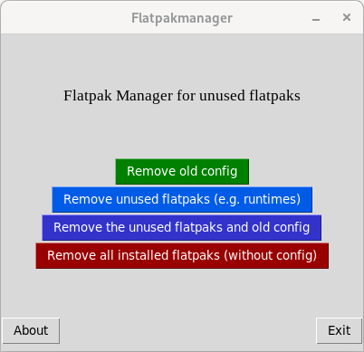

# flatpakmanager
Manage your flatpaks - you can remove them, delete old configuration, remove unused flatpaks and more.

## What can the application do?

- You can delete the configuration and application-data from removed flatpaks
- You can uninstall all the flatpaks you don't need anymore (= dependencies for uninstalled flatpaks)
- You can remove all the installed flatpaks.
